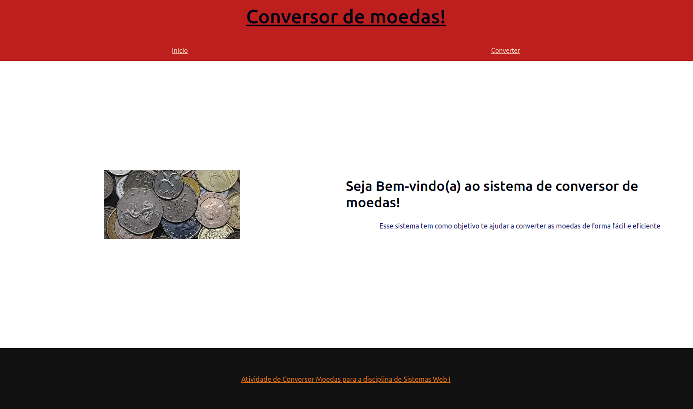
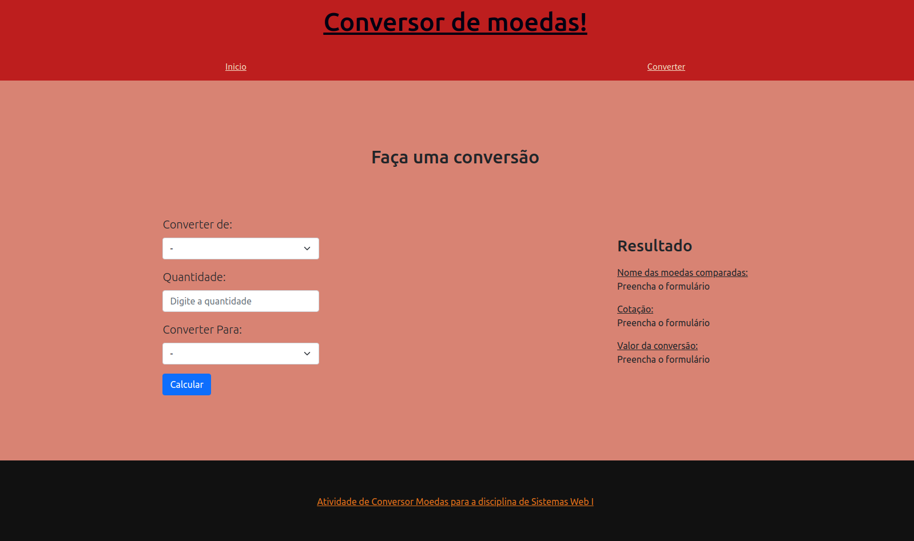
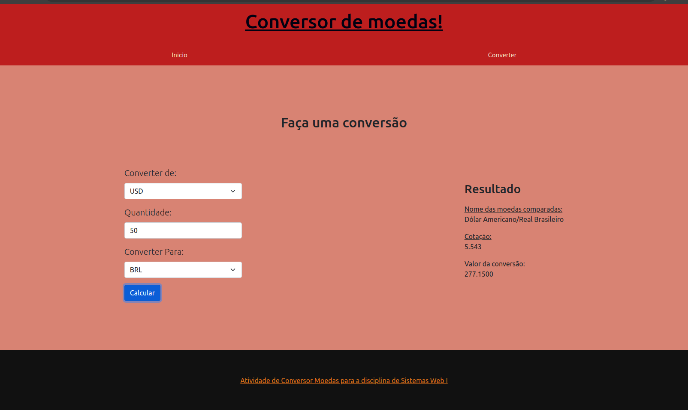

<h1 align="center">
  <br/>
  Currency converter
</h1>

<p align="center">
  

  
  
  <a href="https://github.com/LucasPereiraMiranda/currency-converter/commits/master">
    
  </a>

  <a href="https://github.com/LucasPereiraMiranda/currency-converter/issues">
    
  </a>

  <a href="https://github.com/LucasPereiraMiranda/currency-converter/issues">
    
  </a>
</p>

<br>

## 💻 Descrição do projeto

Projeto de um sistema de conversão de moedas desenvolvido como um dos projetos da atividade prática de sistemas Web I cursado na UFOP em 2021/01.

## 🚀 Techs

O projeto do sistema de conversão de moedas foi construído com as seguintes tecnologias

- [HTML](https://developer.mozilla.org/en-US/docs/Web/HTML)
- [CSS](https://developer.mozilla.org/en-US/docs/Web/CSS)
- [Javascript](https://developer.mozilla.org/en-US/docs/Web/JavaScript)

## 💻 Imagens do projeto em execução

### Página inicial



### Antes de converter as moedas:



### convertendo as moedas:



## :boom: Instruções de execução

```bash
# Podemos clonar este repositório executando
$ git clone git@github.com:LucasPereiraMiranda/currency-converter.git


$ Podemos executar no browser ou com o live server apontando para public/index.html

```

---
